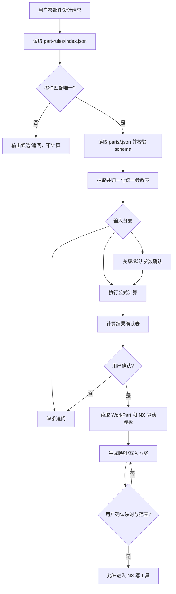

# SK-002 零部件规则包 Schema 与加载方案草案

## 范围与边界

本方案只设计零部件规则包的资源结构、schema 草案、加载流程和测试策略，不迁移现有规则，不修改运行时，不修改 NX plugin。

目标是把连杆、活塞销、止推片等零部件知识从 `SKILL.md` 正文中移出，沉淀为可版本化、可测试、可替换的 JSON 规则包。`SKILL.md` 后续只保留通用流程、门禁、工具调用边界和调度规则。

参考资料：

- `mc-design-nx/assets/source/skills/logic-expression-design/SKILL.md`
- `mc-design-nx/assets/source/skills/conrod-design/SKILL.md`
- `mc-design-nx/assets/source/skills/parameter-mapping/resources/parameter_schema.json`
- `mc-design-nx/assets/source/skills/logic-expression-design/resources/minimal_test_cases.json`
- `references/开发资料/零部件设计智能体功能开发测试案例逻辑表达式表*.xlsx`

## 推荐资源目录结构

```text
mc-design-nx/assets/source/skills/
  part-rules/
    SKILL.md
    resources/
      schemas/
        part_rule_package.schema.json
        part_rule_index.schema.json
      index.json
      parts/
        conrod.json
        piston_pin.json
        thrust_washer.json
      test_cases/
        conrod.cases.json
        piston_pin.cases.json
        thrust_washer.cases.json
      examples/
        conrod.input.complete.json
        conrod.output.complete.json
```

说明：

- `part-rules/SKILL.md` 只说明如何查找、校验和加载规则包，不写具体零件公式。
- `resources/index.json` 负责零件别名、规则包路径、版本和启用状态。
- `resources/schemas/part_rule_package.schema.json` 是规则包 JSON Schema。
- `resources/parts/*.json` 存放单个零件的输入、输出、关联参数、公式、确认表、NX 映射要求和证据。
- `resources/test_cases/*.cases.json` 存放可回归测试用例，避免把测试继续堆在通用 skill 资源里。
- 现有 `logic-expression-design/resources/minimal_test_cases.json` 可在过渡期保留，后续由 `part-rules/resources/test_cases/` 接管。

## 规则包 Schema 草案

建议先使用 `schema_version = "part-rule-package/v1alpha1"`。公式表达式使用受限表达式语言，不直接存任意 Python 脚本；执行时由 `logic-expression-design` 生成标准库 Python 计算脚本。

```json
{
  "$schema": "https://json-schema.org/draft/2020-12/schema",
  "$id": "mc-design.part-rule-package.schema.json",
  "type": "object",
  "required": [
    "schema_version",
    "part_id",
    "part_name",
    "aliases",
    "version",
    "source",
    "owner",
    "applicable_scenarios",
    "input_parameters",
    "output_parameters",
    "associated_parameters",
    "formulas",
    "units",
    "missing_input_questions",
    "confirmation_table",
    "nx_mapping_requirements",
    "evidence_sources",
    "test_cases"
  ],
  "properties": {
    "schema_version": { "const": "part-rule-package/v1alpha1" },
    "part_id": { "type": "string", "pattern": "^[a-z0-9_]+$" },
    "part_name": { "type": "string" },
    "aliases": { "type": "array", "items": { "type": "string" }, "minItems": 1 },
    "version": {
      "type": "object",
      "required": ["package", "updated_at", "change_summary"],
      "properties": {
        "package": { "type": "string" },
        "updated_at": { "type": "string" },
        "change_summary": { "type": "string" }
      }
    },
    "source": {
      "type": "object",
      "required": ["primary_refs", "migration_status"],
      "properties": {
        "primary_refs": { "type": "array", "items": { "type": "string" } },
        "migration_status": {
          "enum": ["draft", "pilot", "validated", "deprecated"]
        }
      }
    },
    "owner": {
      "type": "object",
      "required": ["team", "review_required"],
      "properties": {
        "team": { "type": "string" },
        "review_required": { "type": "boolean" }
      }
    },
    "applicable_scenarios": {
      "type": "object",
      "required": ["task_intents", "supported_branches", "exclusions"],
      "properties": {
        "task_intents": { "type": "array", "items": { "type": "string" } },
        "supported_branches": {
          "type": "array",
          "items": {
            "enum": [
              "complete_design_parameters",
              "incomplete_or_empty_parameters",
              "boundary_only_parameters",
              "mixed_parameters"
            ]
          }
        },
        "exclusions": { "type": "array", "items": { "type": "string" } }
      }
    },
    "input_parameters": {
      "type": "array",
      "items": { "$ref": "#/$defs/parameter_spec" }
    },
    "output_parameters": {
      "type": "array",
      "items": { "$ref": "#/$defs/parameter_spec" }
    },
    "associated_parameters": {
      "type": "array",
      "items": { "$ref": "#/$defs/associated_parameter_spec" }
    },
    "formulas": {
      "type": "array",
      "items": { "$ref": "#/$defs/formula_spec" }
    },
    "units": {
      "type": "object",
      "required": ["default_system", "accepted_units", "conversion_policy"],
      "properties": {
        "default_system": { "enum": ["metric_mm"] },
        "accepted_units": { "type": "array", "items": { "type": "string" } },
        "conversion_policy": {
          "enum": ["convert_known_units", "ask_when_unknown_or_ambiguous"]
        }
      }
    },
    "missing_input_questions": {
      "type": "array",
      "items": { "$ref": "#/$defs/missing_question" }
    },
    "confirmation_table": {
      "type": "object",
      "required": ["result_columns", "include_associated_parameters", "conflict_columns"],
      "properties": {
        "result_columns": { "type": "array", "items": { "type": "string" } },
        "include_associated_parameters": { "type": "boolean" },
        "conflict_columns": { "type": "array", "items": { "type": "string" } }
      }
    },
    "nx_mapping_requirements": {
      "type": "object",
      "required": [
        "required_nx_reads",
        "must_map_output_parameters",
        "forbidden_expression_sources",
        "write_guard"
      ],
      "properties": {
        "required_nx_reads": { "type": "array", "items": { "type": "string" } },
        "must_map_output_parameters": { "type": "array", "items": { "type": "string" } },
        "forbidden_expression_sources": { "type": "array", "items": { "type": "string" } },
        "write_guard": { "type": "array", "items": { "type": "string" } }
      }
    },
    "evidence_sources": {
      "type": "array",
      "items": { "$ref": "#/$defs/evidence_source" }
    },
    "test_cases": {
      "type": "array",
      "items": { "$ref": "#/$defs/test_case_ref" }
    }
  },
  "$defs": {
    "parameter_spec": {
      "type": "object",
      "required": [
        "parameter_id",
        "name_cn",
        "class",
        "required",
        "optional",
        "default_candidate",
        "unit",
        "aliases",
        "value_type",
        "status_policy"
      ],
      "properties": {
        "parameter_id": { "type": "string" },
        "name_cn": { "type": "string" },
        "class": {
          "enum": [
            "design_parameter",
            "boundary_parameter",
            "template_parameter",
            "drive_parameter",
            "associated_parameter"
          ]
        },
        "group": { "type": "string" },
        "required": { "type": "boolean" },
        "optional": { "type": "boolean" },
        "default_candidate": { "type": ["number", "string", "null"] },
        "unit": { "type": ["string", "null"] },
        "aliases": { "type": "array", "items": { "type": "string" } },
        "value_type": { "enum": ["number", "angle", "string"] },
        "validation": { "type": "object" },
        "status_policy": {
          "enum": [
            "required_user_or_source_value",
            "optional_user_value",
            "computed",
            "default_candidate_requires_confirmation"
          ]
        }
      }
    },
    "associated_parameter_spec": {
      "allOf": [
        { "$ref": "#/$defs/parameter_spec" },
        {
          "type": "object",
          "required": ["confirmation_timing", "used_by_formulas", "reason"],
          "properties": {
            "confirmation_timing": {
              "enum": [
                "before_calculation",
                "with_result_confirmation",
                "before_nx_mapping"
              ]
            },
            "used_by_formulas": { "type": "array", "items": { "type": "string" } },
            "reason": { "type": "string" }
          }
        }
      ]
    },
    "formula_spec": {
      "type": "object",
      "required": [
        "formula_id",
        "output_parameter_id",
        "expression",
        "expression_language",
        "dependencies",
        "unit",
        "evidence_ref",
        "tolerance"
      ],
      "properties": {
        "formula_id": { "type": "string" },
        "output_parameter_id": { "type": "string" },
        "expression_language": { "const": "mc_formula_v1" },
        "expression": { "type": "string" },
        "display_expression": { "type": "string" },
        "dependencies": { "type": "array", "items": { "type": "string" } },
        "unit": { "type": "string" },
        "evaluation_order": { "type": "integer" },
        "tolerance": { "type": "number" },
        "evidence_ref": { "type": "string" },
        "source_note": { "type": "string" }
      }
    },
    "missing_question": {
      "type": "object",
      "required": ["parameter_id", "question", "example"],
      "properties": {
        "parameter_id": { "type": "string" },
        "question": { "type": "string" },
        "example": { "type": "string" }
      }
    },
    "evidence_source": {
      "type": "object",
      "required": ["id", "type", "ref", "note"],
      "properties": {
        "id": { "type": "string" },
        "type": { "enum": ["xlsx", "skill", "json", "user_confirmation"] },
        "ref": { "type": "string" },
        "sheet": { "type": "string" },
        "range": { "type": "string" },
        "note": { "type": "string" }
      }
    },
    "test_case_ref": {
      "type": "object",
      "required": ["id", "case_file"],
      "properties": {
        "id": { "type": "string" },
        "case_file": { "type": "string" }
      }
    }
  },
  "additionalProperties": false
}
```

### 公式语言约束

`mc_formula_v1` 只允许：

- 数值字面量、参数 ID 引用、四则运算、括号。
- 函数白名单：`sqrt`、`pow`、`round`、`min`、`max`。
- 角度值统一规范化为 `deg`，例如 `30°` 存为 `{ "value": 30, "unit": "deg" }` 或字符串展示值，但参与计算前必须转数值。

禁止：

- 任意 Python 代码。
- 文件、网络、环境变量、NX 工具调用。
- 以中文参数名作为可执行变量名；表达式依赖必须用 `parameter_id`。

## 规则包索引

`resources/index.json` 建议结构：

```json
{
  "schema_version": "part-rule-index/v1alpha1",
  "updated_at": "2026-06-14",
  "parts": [
    {
      "part_id": "conrod",
      "part_name": "连杆",
      "aliases": ["连杆", "connecting rod", "conrod"],
      "package": "parts/conrod.json",
      "version": "0.1.0",
      "status": "draft"
    },
    {
      "part_id": "piston_pin",
      "part_name": "活塞销",
      "aliases": ["活塞销", "piston pin", "wrist pin"],
      "package": "parts/piston_pin.json",
      "version": "0.1.0",
      "status": "draft"
    },
    {
      "part_id": "thrust_washer",
      "part_name": "止推片",
      "aliases": ["止推片", "thrust washer"],
      "package": "parts/thrust_washer.json",
      "version": "0.1.0",
      "status": "draft"
    }
  ]
}
```

## 示例规则包轮廓

以下是轮廓，不是完整可运行迁移结果。

### conrod.json

```json
{
  "schema_version": "part-rule-package/v1alpha1",
  "part_id": "conrod",
  "part_name": "连杆",
  "aliases": ["连杆", "connecting rod", "conrod"],
  "version": {
    "package": "0.1.0",
    "updated_at": "2026-06-14",
    "change_summary": "从 conrod-design/SKILL.md 和连杆逻辑表达式表抽取的草案"
  },
  "source": {
    "primary_refs": [
      "mc-design-nx/assets/source/skills/conrod-design/SKILL.md",
      "references/开发资料/零部件设计智能体功能开发测试案例逻辑表达式表(1).xlsx"
    ],
    "migration_status": "draft"
  },
  "owner": { "team": "mc-design", "review_required": true },
  "applicable_scenarios": {
    "task_intents": ["连杆逻辑表达式设计", "连杆边界参数计算设计参数"],
    "supported_branches": ["boundary_only_parameters", "mixed_parameters", "incomplete_or_empty_parameters"],
    "exclusions": ["未识别为连杆的通用零件设计"]
  },
  "input_parameters": [
    { "parameter_id": "conrod.boundary.block_height", "name_cn": "机体高度", "class": "boundary_parameter", "group": "boundary", "required": true, "optional": false, "default_candidate": null, "unit": "mm", "aliases": [], "value_type": "number", "status_policy": "required_user_or_source_value" },
    { "parameter_id": "conrod.boundary.compression_clearance", "name_cn": "压缩余隙", "class": "boundary_parameter", "group": "boundary", "required": true, "optional": false, "default_candidate": null, "unit": "mm", "aliases": [], "value_type": "number", "status_policy": "required_user_or_source_value" },
    { "parameter_id": "conrod.boundary.piston_compression_height", "name_cn": "活塞压缩高度", "class": "boundary_parameter", "group": "boundary", "required": true, "optional": false, "default_candidate": null, "unit": "mm", "aliases": [], "value_type": "number", "status_policy": "required_user_or_source_value" },
    { "parameter_id": "conrod.boundary.head_gasket_thickness", "name_cn": "缸盖垫厚度", "class": "boundary_parameter", "group": "boundary", "required": true, "optional": false, "default_candidate": null, "unit": "mm", "aliases": [], "value_type": "number", "status_policy": "required_user_or_source_value" },
    { "parameter_id": "conrod.boundary.crankpin_diameter", "name_cn": "连杆轴颈直径", "class": "boundary_parameter", "group": "boundary", "required": true, "optional": false, "default_candidate": null, "unit": "mm", "aliases": [], "value_type": "number", "status_policy": "required_user_or_source_value" },
    { "parameter_id": "conrod.boundary.piston_pin_diameter", "name_cn": "活塞销直径", "class": "boundary_parameter", "group": "boundary", "required": true, "optional": false, "default_candidate": null, "unit": "mm", "aliases": [], "value_type": "number", "status_policy": "required_user_or_source_value" },
    { "parameter_id": "conrod.boundary.bearing_shell_thickness", "name_cn": "连杆瓦厚度", "class": "boundary_parameter", "group": "boundary", "required": true, "optional": false, "default_candidate": null, "unit": "mm", "aliases": [], "value_type": "number", "status_policy": "required_user_or_source_value" },
    { "parameter_id": "conrod.boundary.crank_radius", "name_cn": "曲柄半径", "class": "boundary_parameter", "group": "boundary", "required": true, "optional": false, "default_candidate": null, "unit": "mm", "aliases": ["行程的一半"], "value_type": "number", "status_policy": "required_user_or_source_value" },
    { "parameter_id": "conrod.boundary.small_end_bushing_thickness", "name_cn": "连杆小头衬套厚度", "class": "boundary_parameter", "group": "boundary", "required": true, "optional": false, "default_candidate": null, "unit": "mm", "aliases": [], "value_type": "number", "status_policy": "required_user_or_source_value" },
    { "parameter_id": "conrod.engine.stroke", "name_cn": "行程", "class": "boundary_parameter", "group": "engine", "required": true, "optional": false, "default_candidate": null, "unit": "mm", "aliases": [], "value_type": "number", "status_policy": "required_user_or_source_value" },
    { "parameter_id": "conrod.engine.bore", "name_cn": "缸径", "class": "boundary_parameter", "group": "engine", "required": true, "optional": false, "default_candidate": null, "unit": "mm", "aliases": [], "value_type": "number", "status_policy": "required_user_or_source_value" }
  ],
  "associated_parameters": [],
  "output_parameters": [
    { "parameter_id": "conrod.design.center_distance", "name_cn": "连杆中心距", "class": "design_parameter", "required": true, "optional": false, "default_candidate": null, "unit": "mm", "aliases": [], "value_type": "number", "status_policy": "computed" },
    { "parameter_id": "conrod.design.big_end_diameter", "name_cn": "连杆大头直径", "class": "design_parameter", "required": true, "optional": false, "default_candidate": null, "unit": "mm", "aliases": [], "value_type": "number", "status_policy": "computed" },
    { "parameter_id": "conrod.design.small_end_diameter", "name_cn": "连杆小头直径", "class": "design_parameter", "required": true, "optional": false, "default_candidate": null, "unit": "mm", "aliases": [], "value_type": "number", "status_policy": "computed" },
    { "parameter_id": "conrod.design.thickness", "name_cn": "连杆厚度", "class": "design_parameter", "required": true, "optional": false, "default_candidate": null, "unit": "mm", "aliases": [], "value_type": "number", "status_policy": "computed" }
  ],
  "formulas": [
    { "formula_id": "conrod.f.center_distance.v1", "output_parameter_id": "conrod.design.center_distance", "expression_language": "mc_formula_v1", "expression": "conrod.boundary.block_height + conrod.boundary.head_gasket_thickness - conrod.boundary.compression_clearance - conrod.boundary.crank_radius - conrod.boundary.piston_compression_height", "display_expression": "机体高度 + 缸盖垫厚度 - 压缩余隙 - 曲柄半径 - 活塞压缩高度", "dependencies": ["conrod.boundary.block_height", "conrod.boundary.head_gasket_thickness", "conrod.boundary.compression_clearance", "conrod.boundary.crank_radius", "conrod.boundary.piston_compression_height"], "unit": "mm", "evaluation_order": 10, "tolerance": 0.000001, "evidence_ref": "conrod.xlsx.logic_expression" },
    { "formula_id": "conrod.f.big_end_diameter.v1", "output_parameter_id": "conrod.design.big_end_diameter", "expression_language": "mc_formula_v1", "expression": "conrod.boundary.crankpin_diameter + 2 * conrod.boundary.bearing_shell_thickness", "display_expression": "连杆轴颈直径 + 2 * 连杆瓦厚度", "dependencies": ["conrod.boundary.crankpin_diameter", "conrod.boundary.bearing_shell_thickness"], "unit": "mm", "evaluation_order": 20, "tolerance": 0.000001, "evidence_ref": "conrod.xlsx.logic_expression" },
    { "formula_id": "conrod.f.small_end_diameter.v1", "output_parameter_id": "conrod.design.small_end_diameter", "expression_language": "mc_formula_v1", "expression": "conrod.boundary.piston_pin_diameter + 2 * conrod.boundary.small_end_bushing_thickness", "display_expression": "活塞销直径 + 2 * 连杆小头衬套厚度", "dependencies": ["conrod.boundary.piston_pin_diameter", "conrod.boundary.small_end_bushing_thickness"], "unit": "mm", "evaluation_order": 30, "tolerance": 0.000001, "evidence_ref": "conrod.xlsx.logic_expression" },
    { "formula_id": "conrod.f.thickness.v1", "output_parameter_id": "conrod.design.thickness", "expression_language": "mc_formula_v1", "expression": "sqrt(conrod.engine.bore * conrod.boundary.crank_radius / 2) / 3", "display_expression": "sqrt(缸径 * 曲柄半径 / 2) / 3", "dependencies": ["conrod.engine.bore", "conrod.boundary.crank_radius"], "unit": "mm", "evaluation_order": 40, "tolerance": 0.000001, "evidence_ref": "conrod.skill.current_formula", "source_note": "Excel 文本写作 *(1/6)，但表格期望值 20.3100960115899 与当前 conrod-design 脚本均对应 /3；SK-003 迁移时需由业务确认。" }
  ],
  "units": { "default_system": "metric_mm", "accepted_units": ["mm", "毫米"], "conversion_policy": "convert_known_units" },
  "missing_input_questions": [
    { "parameter_id": "conrod.boundary.crank_radius", "question": "请提供曲柄半径，单位 mm。若希望用行程/2 换算，请明确确认。", "example": "曲柄半径 67.5mm" }
  ],
  "confirmation_table": {
    "result_columns": ["输出参数", "计算值", "单位", "公式依据", "备注"],
    "include_associated_parameters": false,
    "conflict_columns": ["参数", "用户给定值", "计算值", "差异", "处理方式"]
  },
  "nx_mapping_requirements": {
    "required_nx_reads": ["nx_get_work_part_info", "nx_get_drive_params_list_or_nx_get_all_params_list"],
    "must_map_output_parameters": ["conrod.design.center_distance", "conrod.design.big_end_diameter", "conrod.design.small_end_diameter", "conrod.design.thickness"],
    "forbidden_expression_sources": ["name_cn", "display_expression", "template_field_name"],
    "write_guard": ["计算结果已确认", "真实 NX drive_parameter 已读取", "中文设计参数已映射到真实 nx_expression_name", "映射和写入范围已确认"]
  },
  "evidence_sources": [
    { "id": "conrod.xlsx.logic_expression", "type": "xlsx", "ref": "references/开发资料/零部件设计智能体功能开发测试案例逻辑表达式表(1).xlsx", "sheet": "逻辑表达", "range": "A1:G15", "note": "连杆输入、输出和测试任务描述" },
    { "id": "conrod.skill.current_formula", "type": "skill", "ref": "mc-design-nx/assets/source/skills/conrod-design/SKILL.md", "note": "当前可用连杆公式和脚本实现" }
  ],
  "test_cases": [
    { "id": "conrod_complete_boundary_only", "case_file": "test_cases/conrod.cases.json" },
    { "id": "conrod_missing_boundary", "case_file": "test_cases/conrod.cases.json" }
  ]
}
```

### piston_pin.json

```json
{
  "part_id": "piston_pin",
  "part_name": "活塞销",
  "aliases": ["活塞销", "piston pin", "wrist pin"],
  "input_parameters": [
    { "parameter_id": "piston_pin.boundary.circlip_axial_distance", "name_cn": "活塞销孔挡圈轴向间距", "class": "boundary_parameter", "required": true, "unit": "mm" },
    { "parameter_id": "piston_pin.boundary.conrod_small_end_inner_diameter", "name_cn": "连杆小头内径", "class": "boundary_parameter", "required": true, "unit": "mm" },
    { "parameter_id": "piston_pin.boundary.conrod_bushing_thickness", "name_cn": "连杆衬套厚度", "class": "boundary_parameter", "required": true, "unit": "mm" }
  ],
  "associated_parameters": [
    {
      "parameter_id": "piston_pin.associated.circlip_pin_assembly_clearance",
      "name_cn": "活塞挡圈与销装配间隙",
      "class": "associated_parameter",
      "default_candidate": 0.1,
      "unit": "mm",
      "confirmation_timing": "with_result_confirmation",
      "used_by_formulas": ["piston_pin.f.length.v1"],
      "reason": "Excel 标注为经验参数，需要给设计人员确认"
    },
    {
      "parameter_id": "piston_pin.associated.wall_thickness",
      "name_cn": "活塞销壁厚",
      "class": "associated_parameter",
      "default_candidate": 12.5,
      "unit": "mm",
      "confirmation_timing": "with_result_confirmation",
      "used_by_formulas": ["piston_pin.f.inner_diameter.v1"],
      "reason": "Excel 标注为经验参数，需要给设计人员确认"
    }
  ],
  "output_parameters": [
    { "parameter_id": "piston_pin.design.length", "name_cn": "活塞销长度", "class": "design_parameter", "unit": "mm" },
    { "parameter_id": "piston_pin.design.outer_diameter", "name_cn": "活塞销外径", "class": "design_parameter", "unit": "mm" },
    { "parameter_id": "piston_pin.design.inner_diameter", "name_cn": "活塞销内径", "class": "design_parameter", "unit": "mm" }
  ],
  "formulas": [
    { "formula_id": "piston_pin.f.length.v1", "output_parameter_id": "piston_pin.design.length", "expression": "piston_pin.boundary.circlip_axial_distance - piston_pin.associated.circlip_pin_assembly_clearance * 2", "display_expression": "活塞销孔挡圈轴向间距 - 活塞挡圈与销装配间隙 * 2" },
    { "formula_id": "piston_pin.f.outer_diameter.v1", "output_parameter_id": "piston_pin.design.outer_diameter", "expression": "piston_pin.boundary.conrod_small_end_inner_diameter - piston_pin.boundary.conrod_bushing_thickness * 2", "display_expression": "连杆小头内径 - 连杆衬套厚度 * 2" },
    { "formula_id": "piston_pin.f.inner_diameter.v1", "output_parameter_id": "piston_pin.design.inner_diameter", "expression": "piston_pin.design.outer_diameter - piston_pin.associated.wall_thickness * 2", "display_expression": "活塞销外径 - 活塞销壁厚 * 2" }
  ],
  "evidence_sources": [
    {
      "id": "piston_pin.xlsx.logic_expression",
      "type": "xlsx",
      "ref": "references/开发资料/零部件设计智能体功能开发测试案例逻辑表达式表（活塞销）3.0.xlsx",
      "sheet": "逻辑表达",
      "range": "A1:H9",
      "note": "任务描述示例写 90.0mm，表格计算行使用 90.2mm 并得到活塞销长度 90mm；测试用例需保留该 source_note。"
    }
  ]
}
```

### thrust_washer.json

```json
{
  "part_id": "thrust_washer",
  "part_name": "止推片",
  "aliases": ["止推片", "thrust washer"],
  "input_parameters": [
    { "parameter_id": "thrust_washer.boundary.housing_thrust_bore_inner_diameter", "name_cn": "机体止推档内径", "class": "boundary_parameter", "required": true, "unit": "mm" },
    { "parameter_id": "thrust_washer.boundary.crank_main_journal_diameter", "name_cn": "曲轴主轴颈直径", "class": "boundary_parameter", "required": true, "unit": "mm" },
    { "parameter_id": "thrust_washer.boundary.crank_main_journal_fillet_radius", "name_cn": "曲轴主轴颈圆角半径", "class": "boundary_parameter", "required": true, "unit": "mm" },
    { "parameter_id": "thrust_washer.boundary.housing_thrust_width", "name_cn": "机体止推档宽度", "class": "boundary_parameter", "required": true, "unit": "mm" },
    { "parameter_id": "thrust_washer.boundary.crank_thrust_width", "name_cn": "曲轴主轴颈档宽", "class": "boundary_parameter", "required": true, "unit": "mm" },
    { "parameter_id": "thrust_washer.boundary.housing_lug_slot_width", "name_cn": "机体卡扣槽宽度", "class": "boundary_parameter", "required": true, "unit": "mm" }
  ],
  "associated_parameters": [
    { "parameter_id": "thrust_washer.associated.radial_clearance", "name_cn": "主轴颈和止推片装配径向间隙", "class": "associated_parameter", "default_candidate": 3, "unit": "mm", "confirmation_timing": "before_calculation" },
    { "parameter_id": "thrust_washer.associated.axial_clearance", "name_cn": "曲轴止推档和止推片的轴向间隙", "class": "associated_parameter", "default_candidate": 0.05, "unit": "mm", "confirmation_timing": "before_calculation" },
    { "parameter_id": "thrust_washer.associated.lug_edge_margin", "name_cn": "止推片卡扣边距", "class": "associated_parameter", "default_candidate": 70, "unit": "mm", "confirmation_timing": "before_calculation" },
    { "parameter_id": "thrust_washer.associated.oblique_joint_intersection_margin", "name_cn": "止推片斜接口水平交点边距", "class": "associated_parameter", "default_candidate": 56.5, "unit": "mm", "confirmation_timing": "before_calculation" },
    { "parameter_id": "thrust_washer.associated.oblique_joint_angle", "name_cn": "止推片斜接口斜度", "class": "associated_parameter", "default_candidate": "30°", "unit": "deg", "confirmation_timing": "before_calculation" }
  ],
  "output_parameters": [
    { "parameter_id": "thrust_washer.design.outer_diameter", "name_cn": "止推片外径", "class": "design_parameter", "unit": "mm" },
    { "parameter_id": "thrust_washer.design.inner_diameter", "name_cn": "止推片内径", "class": "design_parameter", "unit": "mm" },
    { "parameter_id": "thrust_washer.design.axial_thickness", "name_cn": "止推片厚度（轴向）", "class": "design_parameter", "unit": "mm" },
    { "parameter_id": "thrust_washer.design.lug_edge_margin", "name_cn": "止推片卡扣边距", "class": "design_parameter", "unit": "mm" },
    { "parameter_id": "thrust_washer.design.lug_width", "name_cn": "止推片卡扣宽度", "class": "design_parameter", "unit": "mm" },
    { "parameter_id": "thrust_washer.design.oblique_joint_intersection_margin", "name_cn": "止推片斜接口水平交点边距", "class": "design_parameter", "unit": "mm" },
    { "parameter_id": "thrust_washer.design.oblique_joint_angle", "name_cn": "止推片斜接口斜度", "class": "design_parameter", "unit": "deg" }
  ],
  "formulas": [
    { "formula_id": "thrust_washer.f.outer_diameter.v1", "output_parameter_id": "thrust_washer.design.outer_diameter", "expression": "thrust_washer.boundary.housing_thrust_bore_inner_diameter", "display_expression": "机体止推档内径" },
    { "formula_id": "thrust_washer.f.inner_diameter.v1", "output_parameter_id": "thrust_washer.design.inner_diameter", "expression": "thrust_washer.associated.radial_clearance * 2 + thrust_washer.boundary.crank_main_journal_diameter + 2 * thrust_washer.boundary.crank_main_journal_fillet_radius", "display_expression": "主轴颈和止推片装配径向间隙 * 2 + 曲轴主轴颈直径 + 2 * 曲轴主轴颈圆角半径" },
    { "formula_id": "thrust_washer.f.axial_thickness.v1", "output_parameter_id": "thrust_washer.design.axial_thickness", "expression": "(thrust_washer.boundary.crank_thrust_width - thrust_washer.boundary.housing_thrust_width - thrust_washer.associated.axial_clearance * 2) / 2", "display_expression": "(曲轴主轴颈档宽 - 机体止推档宽度 - 曲轴止推档和止推片的轴向间隙 * 2) / 2" },
    { "formula_id": "thrust_washer.f.lug_edge_margin.v1", "output_parameter_id": "thrust_washer.design.lug_edge_margin", "expression": "thrust_washer.associated.lug_edge_margin", "display_expression": "经验值" },
    { "formula_id": "thrust_washer.f.lug_width.v1", "output_parameter_id": "thrust_washer.design.lug_width", "expression": "thrust_washer.boundary.housing_lug_slot_width", "display_expression": "机体卡扣槽宽度" },
    { "formula_id": "thrust_washer.f.oblique_joint_intersection_margin.v1", "output_parameter_id": "thrust_washer.design.oblique_joint_intersection_margin", "expression": "thrust_washer.associated.oblique_joint_intersection_margin", "display_expression": "经验值" },
    { "formula_id": "thrust_washer.f.oblique_joint_angle.v1", "output_parameter_id": "thrust_washer.design.oblique_joint_angle", "expression": "thrust_washer.associated.oblique_joint_angle", "display_expression": "经验值" }
  ]
}
```

## logic-expression-design 加载和执行流程

后续 `logic-expression-design` 应从“加载具体零件 skill”改为“加载规则包并执行通用状态机”。

1. 识别零件
   从用户任务中抽取零件名、别名、机型、输入参数文本。读取 `part-rules/resources/index.json`，用 `part_name + aliases` 匹配 `part_id`。如果匹配多个，输出候选并追问；如果没有匹配，说明缺少规则包，不进入公式计算。

2. 选择规则包
   按 `part_id` 读取 `resources/parts/<part_id>.json`，校验 `schema_version`、`version.package`、`source.migration_status`。schema 校验失败时阻断，不能降级为 prompt 猜公式。

3. 归一化输入
   根据规则包的 `input_parameters`、`associated_parameters`、`output_parameters` 建立统一参数表，字段仍遵守 `parameter-mapping/resources/parameter_schema.json`。中文名只用于展示和语义匹配，内部计算用 `parameter_id`。

4. 判断输入分支
   复用 `input_branch_state_machine.json` 的四类分支：参数齐全、参数不全/无参数、仅边界参数、混合参数。

5. 校验输入完整性
   对 `required=true` 且没有用户值、来源值或确认默认值的参数生成缺参追问表。对 `default_candidate` 或 `associated_parameter`，按 `confirmation_timing` 决定是否必须先确认。

6. 执行公式
   将 `mc_formula_v1` 转为临时 Python 计算脚本。脚本只接收 JSON 输入，只输出 JSON，仍遵守当前 `logic-expression-design` 的脚本规则。公式依赖必须全部来自 `parameter_id`，不得用中文名作为变量。

7. 生成确认表
   按规则包 `confirmation_table.result_columns` 输出计算结果。若规则包含关联经验参数，必须把经验参数、默认候选值、使用公式、确认时机列入确认表或预确认表。混合参数冲突时输出 `conflict_columns`。

8. 进入 NX 映射门禁
   只有用户确认计算结果后，才进入 NX 阶段。必须读取当前 WorkPart 和真实驱动参数，并把规则包输出参数映射到真实 `drive_parameter.nx_expression_name`。`nx_update_param` 和 `nx_batch_update_params` 的表达式名只能来自 NX 读取结果，不能来自 `name_cn`、公式输出名或模板字段名。

推荐流程图：


## 测试策略

测试分为 schema 校验、规则计算、流程门禁和 NX 写入防线四层。

### 1. 完整输入

目标：完整边界参数能计算输出参数，并进入结果确认表。

用例：

- `conrod_complete_boundary_only`：期望中心距 212、大头 88、小头 51、厚度 20.3100960115899。
- `piston_pin_complete_boundary_only`：期望长度 90、外径 46、内径 21，并列出 0.1 与 12.5 两个经验参数。
- `thrust_washer_complete_boundary_only`：期望外径 123、内径 98、轴向厚度 3.1、卡扣边距 70、卡扣宽度 10、斜接口水平交点边距 56.5、斜度 30deg。

断言：

- `ok=true`。
- 输出包含 `formulas`、`units`、`trace`、`warnings`。
- 下一状态为 `present_calculation_confirmation_table`。

### 2. 缺参输入

目标：缺少必需边界参数时只追问缺失项，不计算、不进入 NX 映射。

断言：

- `ok=false`。
- `missing_inputs` 与规则包 required 参数差集一致。
- 不生成建模方案，不调用 NX 写工具。

### 3. 仅边界参数

目标：用户只给边界/发动机参数时，必须选择公式族并计算设计参数。

断言：

- 输入表中所有用户值的 class 是 `boundary_parameter`。
- 输出值的 class 是 `design_parameter`，source 是 `logic_expression`。
- 边界参数不得进入 NX 写入候选。

### 4. 混合参数

目标：用户同时给设计参数和边界参数时，先用边界计算，再做冲突确认。

断言：

- 若用户给定设计参数与计算值差异超过 tolerance，输出冲突表。
- 未确认冲突处理前，不合并到最终设计参数表。
- 不进入 NX 映射。

### 5. 关联参数需确认

目标：经验默认、联动参数和关联参数不能静默使用为最终建模依据。

断言：

- `associated_parameter.default_candidate` 只能产生 `default_candidate` 状态。
- `confirmation_timing=before_calculation` 时，未确认前不得输出最终计算结果，只能输出待确认经验参数表或预览态。
- `confirmation_timing=with_result_confirmation` 时，结果表必须同时列出经验参数、默认候选值和使用公式。

### 6. 单位解析

目标：支持 `mm`、`毫米`、中文标点和角度 `°`，单位不明时追问。

断言：

- `350mm`、`350 毫米` 规范化为 `{ value: 350, unit: "mm" }`。
- `30°` 规范化为 `{ value: 30, unit: "deg" }`，展示可保留 `30°`。
- 未声明单位且规则包没有默认单位时阻断。

### 7. 公式变更回归

目标：公式变更必须触发快照差异和数值回归。

断言：

- 每个 `formula_id` 有稳定版本号。
- 修改 `expression` 后，完整输入用例的输出数值必须重新断言。
- `source_note` 或 evidence 发生变化时需要 owner review。
- 连杆厚度存在 Excel 公式文本与当前脚本/期望值差异，SK-003 必须作为业务确认项。

### 8. 禁止中文参数名直接写 NX

目标：任何 NX 写入方案都必须使用真实 NX 表达式名。

断言：

- 模拟 NX drive 参数列表，映射后 `nx_expression_name` 必须来自模拟列表。
- 当只有 `name_cn` 或规则包输出参数名可用时，状态为 `blocked` 或 `requires_user_confirmation`。
- `nx_update_param({"expression_name": "连杆中心距"})` 这类计划必须失败。
- `boundary_parameter`、`design_parameter`、`associated_parameter` 均不得直接作为 NX 表达式名。

## SKILL.md 保留与迁移边界

### 应保留在 SKILL.md 的内容

- 通用任务流程：识别零件、加载规则包、归一化参数、分支判断、追问、计算、确认、NX 映射门禁。
- 工具调用边界：哪些阶段允许读取文件、生成计算脚本、读取 NX、写 NX。
- 全局禁止事项：跳过缺参检查、未确认结果写 NX、中文名直接写表达式、边界参数写 NX。
- 状态机引用：`input_branch_state_machine.json`。
- 规则包加载失败、schema 校验失败、公式缺失、单位不明时的阻断策略。
- 用户交互模板：缺参追问表、结果确认引导、映射确认引导的通用格式。

### 必须迁到规则包的内容

- 具体零件名、别名和适用场景。
- 零件输入参数、输出参数、关联参数、经验默认值。
- 具体公式、公式依赖、公式版本、公式来源说明。
- 单位、默认单位、单位换算策略。
- 缺参追问的参数级问题和示例值。
- 结果确认表的零件输出行、经验参数行、冲突行。
- NX 映射要求中具体必须映射的输出参数列表。
- evidence_sources 和 test_cases。
- 任何来自 Excel 或业务资料的零件专属备注。

### 不应迁入规则包的内容

- NX 工具名称白名单的全局定义。
- 当前 WorkPart 确认、驱动参数读取、用户确认写入范围等全局门禁。
- Python 脚本生成目录、JSON 输入输出协议等执行器约定。
- 数据库、TC、NX bridge 的连接和异常处理。

## SK-003 连杆试点迁移提示词草案

```text
任务编号：SK-003

你是 mc-design 连杆规则包试点迁移智能体。

工作目录：
E:\A0_Projects\A1_Dynamics_Design_LM\mc-design

参考：
- .tasks/SK-002_part_rules_schema_design.md
- mc-design-nx/assets/source/skills/conrod-design/SKILL.md
- mc-design-nx/assets/source/skills/logic-expression-design/SKILL.md
- mc-design-nx/assets/source/skills/parameter-mapping/resources/parameter_schema.json
- mc-design-nx/assets/source/skills/logic-expression-design/resources/minimal_test_cases.json
- references/开发资料/零部件设计智能体功能开发测试案例逻辑表达式表(1).xlsx

范围限制：
- 只做连杆试点迁移。
- 不修改 NX plugin。
- 不修改运行时。
- 不批量迁移活塞销、止推片。
- 不改变现有 NX 工具调用协议。

目标：
1. 新增 part-rules 资源结构和 schema 草案文件。
2. 新增 conrod.json，把连杆 11 个输入、4 个输出、公式、单位、缺参追问、确认表、NX 映射要求、evidence_sources 和测试用例从 conrod-design/SKILL.md 正文迁入规则包。
3. 调整 conrod-design/SKILL.md，只保留连杆任务调度、必须加载 logic-expression-design/part-rules、NX 写入门禁和异常处理，不再硬编码完整参数表和公式脚本。
4. 调整 logic-expression-design/SKILL.md 的描述，使其说明通过 part-rules/index.json 识别零件、选择规则包、校验输入、执行公式、生成确认表、进入 NX 映射门禁。
5. 补齐或迁移连杆测试用例，覆盖完整输入、缺参输入、混合参数、单位解析、公式回归和禁止中文参数名直接写 NX。

特别注意：
- 连杆厚度公式存在证据差异：Excel 文本显示 `((缸径*曲柄半径/2)^(0.5))*(1/6)`，但 Excel 期望值 20.3100960115899 和当前 conrod-design 脚本对应 `sqrt(缸径 * 曲柄半径 / 2) / 3`。迁移时不要静默掩盖，必须在 conrod.json 的 source_note/evidence 中保留，并在最终说明中列为需要业务确认的事项。
- “曲柄半径 = 行程 / 2”不能默认代入；只有用户明确给出或确认时才能使用。
- 中文设计参数名不得作为 NX expression_name。

验收：
- conrod.json 能通过 schema 校验。
- 完整输入用例能得到当前既有期望值。
- 缺参用例只输出缺失参数，不生成 NX 写入计划。
- conrod-design/SKILL.md 中不再包含完整公式实现和计算脚本大段代码。
- 未确认结果或未确认映射时，不允许出现 NX 写工具调用方案。
```
