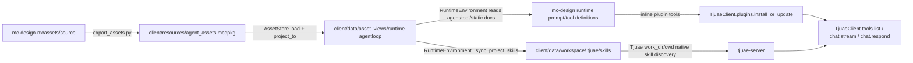

# CLIENT-ARCH-001 架构边界图

更新时间：2026-06-14

## 资产链路

## 路径职责

| 路径 | 当前职责 | 生成关系 | 读取关系 | 是否可删除 | 是否可重建 |
|---|---|---|---|---|---|
| `mc-design-nx/assets/source/` | 资产源码区，包含 agent runtime、skills、tools、static | 人工维护，git 跟踪 | 打包脚本读取 | 不建议删除 | 不是投影，需从 git/source 恢复 |
| `mc-design-nx/client/resources/agent_assets.mcdpkg` | 资产打包快照 | `export_assets.py` 从 `assets/source` 生成 | `AssetStore` 读取 | 不能在未重建前删除 | 可从 `assets/source` 重新生成 |
| `mc-design-nx/client/resources/mc-design-package.mcdpkg` | 仓库级运行配置包 | `payload_builder.py` 从 `configure/mc-design-package.config` 编码 | `load_config()` 读取 | 不能在未重建前删除 | 可从 package config 重新生成 |
| `mc-design-nx/client/resources/nx_tools_manifest.json` | NX 工具 manifest 快照 | 构建/生成脚本产出 | 本地工具 registry/测试/打包读取 | 不能在未重建前删除 | 可从 NX tool metadata 重新生成 |
| `mc-design-nx/client/data/asset_views/runtime-agentloop/` | 当前运行期 asset projection/cache | `AssetStore.project_to()` 从 `.mcdpkg` 生成 | `RuntimeEnvironment.asset_root` 读取 | 客户端停止后可清理 | 可由客户端 refresh 重建 |
| `mc-design-nx/client/data/asset_views/runtime-live/` | 旧 runtime projection/cache | 历史运行生成 | 当前源码未读取 | 建议归档后删除 | 不应重建为当前结构 |
| `mc-design-nx/client/data/asset_views/test-local-dev/` | 旧测试/开发投影 | 历史运行或测试生成 | 当前源码未读取 | 建议归档后删除 | 不应重建为当前结构 |
| `mc-design-nx/client/data/workspace/.tjuae/skills/` | Tjuae workspace skill 托管副本 | 从 `runtime-agentloop/skills` 同步 | Tjuae server 通过 work_dir/cwd 间接发现 | 客户端停止且保留非托管 skill 后可清理 | 可由 `RuntimeEnvironment.refresh()` 重建 |
| `mc-design-nx/client/data/workspace/.beya/` | 历史 Beya workspace | 历史运行生成 | 当前源码未读取 | 建议归档后删除 | 不应重建 |
| `mc-design-nx/client/data/governance/` | 历史治理 overlay/pending 数据 | 历史运行生成 | 当前 active runtime 未读取 | 需先确认无 pending 价值，再归档/删除 | 不建议自动重建 |
| `mc-design-nx/client/cc_haha_agent_runtime_migration_pack/` | 外部 cc-haha 迁移参考残留 | 人工拷入 | 源码/测试/打包未引用 | 建议迁到 references 或删除 | 不属于运行构建重建物 |
| `mc-design-nx/package/windows/output/` | Windows 打包输出、解包工作目录、日志 | 构建生成 | 源码/测试/打包脚本不依赖既有输出 | 可按保留策略清理 | 可通过重新构建生成 |
| `mc-design-nx/package/windows/runtime/` | 离线 Python runtime 构建依赖 | 仓库保留 | 构建脚本依赖 | 不建议清理 | 如丢失需重新取得离线 runtime |

## tjuae-sdk 读取边界

本次审计的实际代码路径如下：

- `load_config()` 将 `asset_bundle_file` 固定为 `client/resources/agent_assets.mcdpkg`，将 `data_dir` 固定为 `client/data`。
- `ClientApp` 创建 `AssetStore(config)`，再创建 `RuntimeHost(...)`。
- `RuntimeHost` 创建 `RuntimeEnvironment(...)`。
- `RuntimeEnvironment.__init__()` 将 `workspace_root` 设为 `client/data/workspace`，将 `asset_view_root` 设为 `client/data/asset_views/runtime-agentloop`。
- `RuntimeEnvironment.refresh()` 调用 `AssetStore.project_to(asset_view_root)`，再调用 `_sync_project_skills()`。
- `_sync_project_skills()` 将 `asset_view_root/skills/*` 复制到 `workspace/.tjuae/skills/*`，并写 `.mc-design-managed` 与 `.mc-design-managed.json`。
- `McDesignTjuaeAdapter.run()` 配置 provider/settings，创建或复用 session，同步 inline runtime plugin，最后调用 `client.chat.stream(...)` 或 `client.chat.respond(...)`。

结论：

- `tjuae-sdk` 不直接读取 `agent_assets.mcdpkg`。
- `tjuae-sdk` 不直接读取 `asset_views`。
- `tjuae-server` 通过 `work_dir=client/data/workspace` 间接读取或发现 `.tjuae/skills`。
- mc-design 提供给 tjuae 的工具能力通过 inline plugin 的 `plugins.install_or_update` 注入，随后用 `plugins.list`/`tools.list` 校验可见性，再由 `chat.stream`/`chat.respond` 驱动执行。

## 当前数据目录异常

`client/data/asset_views/runtime-agentloop` 当前 marker 显示 13 个 skill、3 个 tool，和当前 `agent_assets.mcdpkg` 一致。

`client/data/asset_views/runtime-live` 和 `client/data/asset_views/test-local-dev` marker 仍显示旧结构，例如：

- 多个 agent：`beya`、`design_agent`、`governance_agent`、`reviewer`
- 旧 skill：`nx-auto-drawing`、`agentloop-core`、`governance-test` 等
- 旧 tool：`tool.governance`、`tool.mysql`、`tool.external`、`tool.teamcenter` 等

这些旧 projection 是当前目录结构最容易误导审计的部分，应归为 runtime/cache 或 legacy evidence，而不是当前运行资产。

## cc_haha 判断

`mc-design-nx/client/cc_haha_agent_runtime_migration_pack/` 只包含：

- `reference/cc-haha/bin/claude-haha`

该文件是 Bash 脚本，执行 `bun ./src/localRecoveryCli.ts` 或 `bun ./src/entrypoints/cli.tsx`。它不属于 Python client、Tjuae server、NX plugin 或 Windows payload。`rg` 未发现源码、测试、打包脚本引用。建议移出 client 目录。
