# 零部件设计智能体稳定性与正确率工作指导书

本文面向维护 `mc-design` 的工程师。目标不是解释“智能体应该更聪明”，而是把错误拆到可定位、可修改、可验证的工程对象：agent 定义、Skill 规则、工具 YAML 契约、工具 Python 实现、NX C# 执行器、K8s 连接器路由、运行时桥接和交付物校验。

## 1. 源码依据

| 对象 | 路径 | 作用 |
| --- | --- | --- |
| 主智能体 | `mc-design-nx/client/plugins/mc-design/agents/design-agent.md` | 默认入口，只允许用原生 `Agent` 分派 7 个子智能体和 `AskUserQuestion`。 |
| 7 个子智能体 | `mc-design-nx/client/plugins/mc-design/agents/*.md` | 每个任务的边界、可用工具、完成标准。 |
| 业务 Skill | `mc-design-nx/client/plugins/mc-design/skills/*/SKILL.md` | 每条链路的工作顺序、禁止事项、完成标准。 |
| MCP 工具契约 | `mc-design-nx/client/plugins/mc-design/mcp_tools/<toolbox>/<tool>/tool.yaml` | 模型可见工具名、描述、输入输出 schema、安全注解。 |
| MCP 工具实现 | `mc-design-nx/client/plugins/mc-design/mcp_tools/<toolbox>/<tool>/tool.py` | 确定性参数检查、路径约束、路由封装。 |
| 客户端运行时 | `mc-design-nx/client/src/mc_design_client` | 本地 HTTP API、TJUAE live coordinator、插件同步、日志和 MCP 服务。 |
| NX 执行器 | `mc-design-nx/nx-plugin` | NX11/.NET C# HTTP 工具执行面。 |
| AI 服务 | `mc-design-ai-service/beya_mcp` | K8s MCP 入口、WebSocket turn-stream 桥接、连接器 router。 |
| 连接器配置 | `mc-design-ai-service/beya.toml` | MySQL、IPM、QPP、ECR、Teamcenter、图片解密路由。 |
| 回归测试 | `mc-design-nx/client/tests`、`mc-design-ai-service/tests` | 架构边界、工具契约、公式、DFMEA、报告、运行时桥接。 |

## 2. 总体架构图

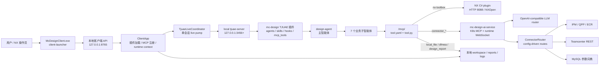

核心结论：

- 主智能体只分派，不直接调用 NX、Teamcenter、MySQL、报告、DFMEA 或外部系统工具。
- 工具说明和 schema 的唯一来源在本地插件 `tool.yaml`，K8s 只做连接器路由，不拥有模型可见工具契约。
- 有副作用动作必须由子智能体完成前置确认，并由工具实现做第二层硬拦截。
- 正式交付必须有文件路径、大小、sha256、校验结果或 NX 回读保存证据。

## 3. 总体运行时序图

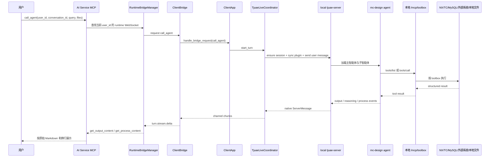

## 4. 主智能体治理架构

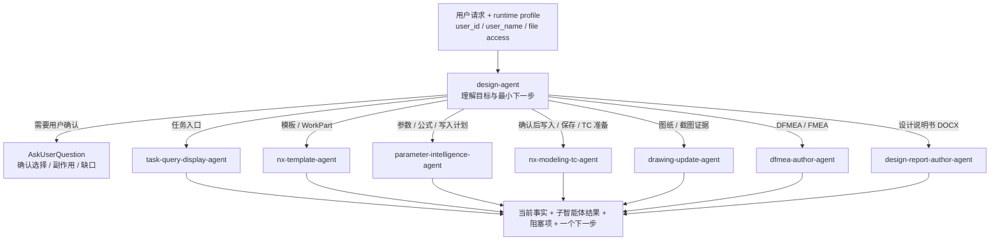

主智能体修复原则：

- 分派错了，优先改 `design-agent.md` 和 `workflow-orchestration/SKILL.md`。
- 子智能体越界了，优先改对应 agent 的 `tools` 列表和边界说明。
- 工具参数填错，优先改对应 `tool.yaml` 的 description/input schema；如果必须硬拦截，再改 `tool.py` 或 hook。
- 业务事实算错，不能只改 prompt；应把事实沉淀到 `resources/`、`scripts/` 或模板，并补测试。

## 5. 子智能体 1：多系统任务抓取与展示

源码：`task-query-display-agent.md`  
技能：`enterprise-task-intake`  
主要工具：`query_ipm_list`、`connect_qpp`、`query_ecr_list`、`local_python_task_start/status`、`Read`、`Write`

### 架构图

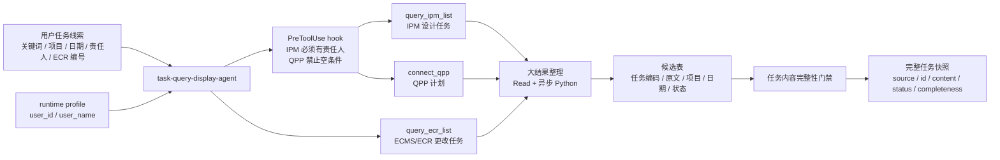

### 工作过程示意图

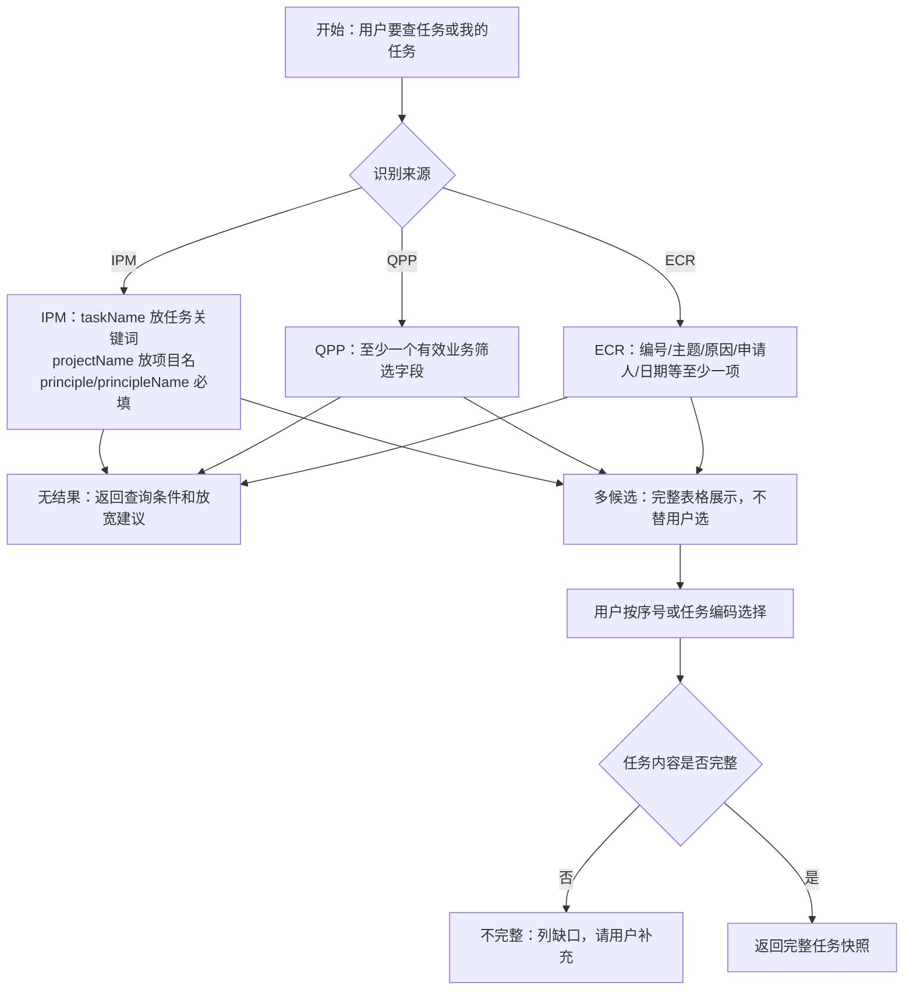

常见错误和处理：

| 错误 | 先看证据 | 修改位置 | 回归抓手 |
| --- | --- | --- | --- |
| IPM 查不到“我的任务” | `logs/conversations/*.jsonl` 中工具入参是否有 `principle` 或 `principleName` | `enterprise-task-intake/SKILL.md`、`query_ipm_list/tool.yaml`、hook | `test_usage_issue_fixes.py`、`test_design_skill_contract.py` |
| QPP 空条件打到外部系统 | hook 是否返回 `QPP_QUERY_REQUIRES_FILTER` | `hooks/mc_design_connector_guard.py` | 增加 hook 单测 |
| 表格摘要导致任务内容丢失 | 输出是否原样包含 `display_markdown` 或 `taskName` 原文 | `enterprise-task-intake/SKILL.md` | 增加真实 IPM fixture，断言无省略号 |

## 6. 子智能体 2：NX 零部件模板调用

源码：`nx-template-agent.md`  
技能：`template-source-selection`、`nx-workpart-confirmation`  
主要工具：`teamcenter_get_parts_from_specified_folder`、`teamcenter_get_part_rev_classification_attribute`、`teamcenter_get_part_rev_children`、`nx_open_tcpart`、`nx_open_part`、`nx_get_work_part_info`、`nx_create_new_part`

### 架构图

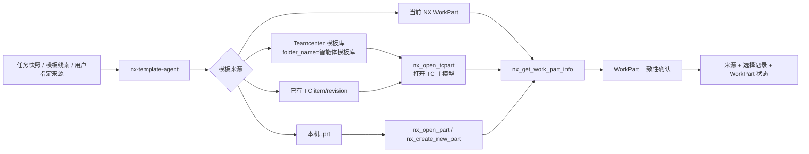

### 工作过程示意图

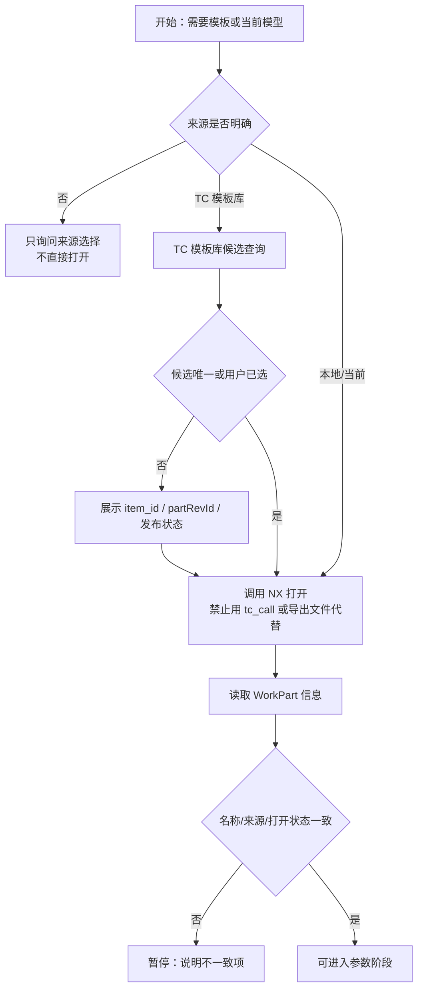

常见错误和处理：

| 错误 | 先看证据 | 修改位置 | 回归抓手 |
| --- | --- | --- | --- |
| 用 `tc_call` 打开模型 | 工具事件里是否出现 `tc_call` path 类似 OpenTCPart | `nx-template-agent.md`、`nx-workpart-confirmation/SKILL.md`、`tc_call/tool.py` | 增加 `TC_CALL_NX_OPEN_UNSUPPORTED` 单测 |
| 把 TC 查询候选当作已打开 | 是否缺少 `nx_get_work_part_info` | agent/Skill 完成标准 | `test_design_skill_contract.py` |
| MySQL 被用于查模板 | 工具事件是否有 `mysql_query` 查询模板 | `template-source-selection/SKILL.md`、`mysql_query/tool.yaml` | 合同测试断言禁止描述 |

## 7. 子智能体 3：参数智能化处理

源码：`parameter-intelligence-agent.md`  
技能：`parameter-evidence-extraction`、`formula-parameter-calculation`、`parameter-write-plan`  
主要工具：`mysql_query`、`nx_get_work_part_info`、`nx_get_all_params_list`、`nx_get_drive_params_list`、`nx_find_params`、`nx_resolve_parameter`、`local_python_task_start/status`、`Read`、`Write`

### 架构图

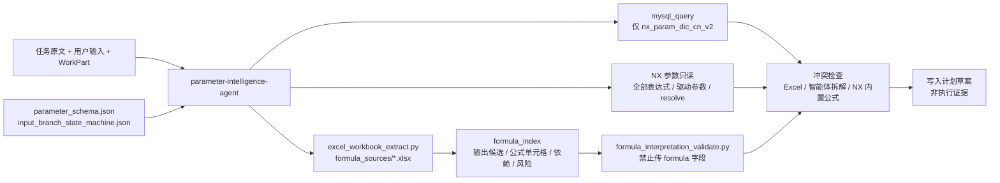

### 工作过程示意图

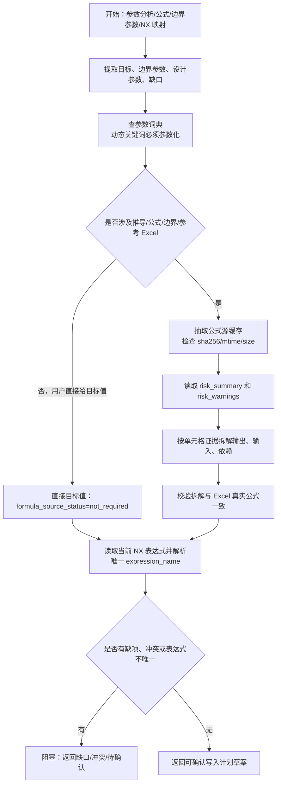

正确率抓手：

- 只要出现公式来源、边界参数、参数拆解或参考 Excel，`formula_source_status` 必须是 `checked` 或 `blocked`，不能是 `not_required`。
- 智能体不能把业务公式写进 agent、Skill、临时 Python 或 prompt；真实公式只来自 Excel 单元格或 NX 内置表达式。
- `formula_interpretation_validate.py` 输入不能带 `formula` 字段；必须让脚本从 Excel 读取真实公式。
- 中文参数不能直接当 `expression_name`；写入计划必须给出真实 NX 表达式名、当前 equation、单位和可写状态。

常见错误和处理：

| 错误 | 先看证据 | 修改位置 | 回归抓手 |
| --- | --- | --- | --- |
| 公式算错 | 抽取 JSON 的 `formula_index`、校验结果 `diagnostics` | `formula_sources/*.xlsx`、两个公式脚本、参数 Skill | `test_formula_interpretation_pipeline.py` |
| 用主智能体推导式生成计划 | 子智能体 prompt 或日志中是否缺 Excel 单元格证据 | `design-agent.md`、`workflow-orchestration/SKILL.md` | 合同测试断言关键句 |
| 表达式不唯一仍进入写入 | `nx_resolve_parameter` 是否唯一命中 | `parameter-write-plan/SKILL.md`、NX 工具说明 | 增加 NX 参数解析 fixture |

## 8. 子智能体 4：自动化参数化建模及 TC 回传

源码：`nx-modeling-tc-agent.md`  
技能：`nx-parameter-execution`、`tc-release-preparation`  
主要工具：`nx_update_param`、`nx_batch_update_params`、`nx_create_param`、`nx_get_all_params_list`、`nx_get_drive_params_list`、`nx_save_part`、`teamcenter_upload_file_function`、`teamcenter_copy_item_content_create`、`teamcenter_export_dataset_file`、`local_file_exists/read_bytes`

### 架构图

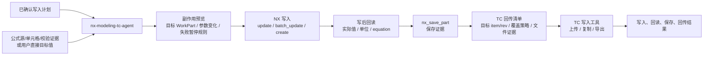

### 工作过程示意图

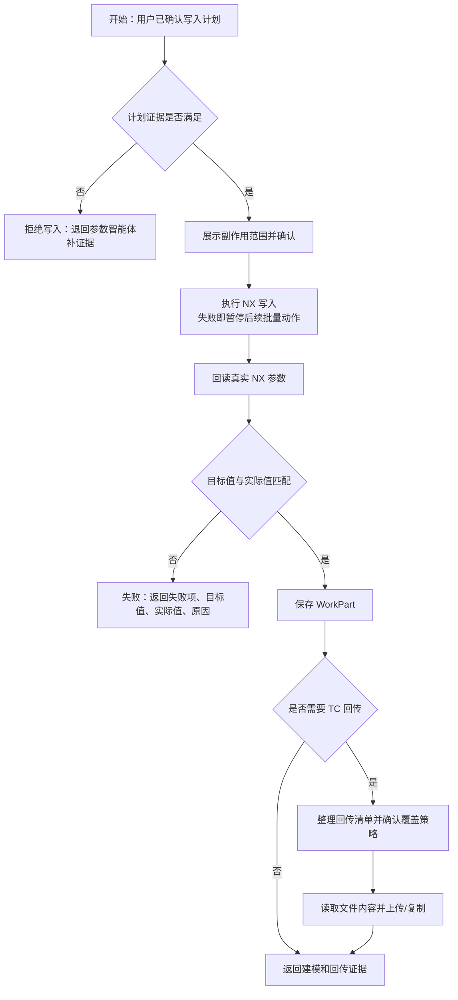

稳定性抓手：

- 写入前必须有用户确认和证据检查，不能由参数智能体直接写 NX。
- 写入后必须回读；没有回读不能说建模完成。
- 回读后必须保存；没有 `nx_save_part` 证据不能说模型已保存。
- Teamcenter 写入必须确认 `item_id`、`item_rev_id`、`file_name`、`file_content` 和覆盖策略；不要把本地路径当 `file_content`。
- 服务侧会用当前 `user_id` 与 `owner_id` 做写权限判断，权限失败不要重试为绕过。

## 9. 子智能体 5：二维图纸自动绘制更新

源码：`drawing-update-agent.md`  
技能：`tc-drawing-selection`、`nx-view-screenshot-evidence`  
主要工具：`teamcenter_get_part_rev_children`、`teamcenter_export_dataset_file`、`nx_open_tc_drawing`、`nx_get_all_view_names`、`nx_switch_view`、`nx_fit_view`、`nx_create_image`、`nx_get_view_style`、`nx_set_view_style`、`local_file_exists`

### 架构图

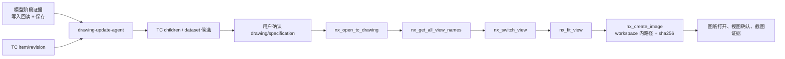

### 工作过程示意图

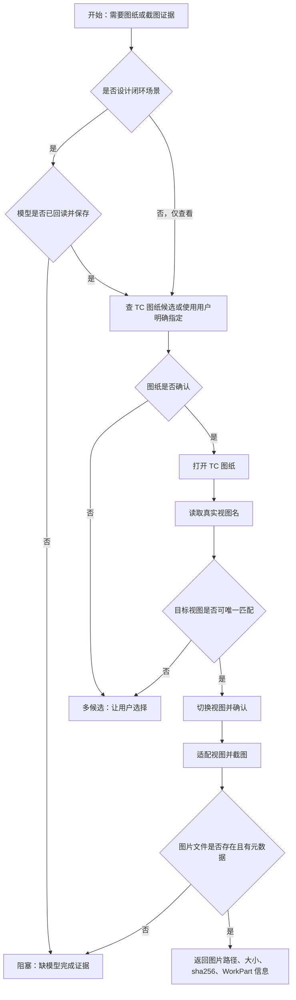

稳定性抓手：

- 截图顺序固定为 `nx_get_all_view_names` -> `nx_switch_view` -> 必要时 `nx_fit_view` -> `nx_create_image`。
- `nx_create_image` 的路径必须在客户端 workspace 内；工具实现会拒绝外部路径，并在成功后补 `size_bytes`、`sha256`、`workspace_relative_path`。
- 图纸候选必须来自 Teamcenter 或用户明确指定，不能按文件名猜。

## 10. 子智能体 6：DFMEA 表自动编写

源码：`dfmea-author-agent.md`  
技能：`dfmea-risk-authoring`、`dfmea-workbook-generation`  
主要工具：`dfmea_template_list`、`dfmea_template_select`、`dfmea_template_inspect`、`dfmea_calculate_risk`、`dfmea_fill_template`、`dfmea_validate_workbook`、可选 TC 导出参考、`local_file_exists/read_bytes`

### 架构图

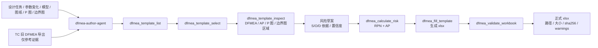

### 工作过程示意图

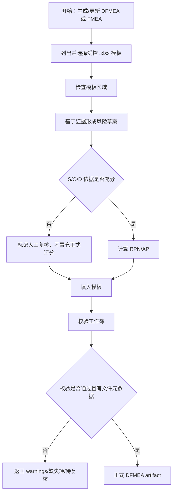

稳定性抓手：

- 正式运行只使用受控 `.xlsx` 模板；TC 导出的旧 `.xls` 只能作参考。
- 不用 `Read/Write`、系统命令或临时 Python 解析 DFMEA 工作簿，正式路径必须走 `dfmea_*` 工具。
- 低置信度风险项保留 `manual_review_required`，不能为了完成交付而删除复核标记。
- 没有 `dfmea_validate_workbook` 结果、文件大小和 sha256，不能称为正式交付。

## 11. 子智能体 7：设计说明书自动编写

源码：`design-report-author-agent.md`  
技能：`report-evidence-collection`、`report-docx-generation`  
主要工具：`design_report_template_inspect`、`design_report_start`、`design_report_collect`、`design_report_decrypt_image`、`design_report_answer`、`design_report_status`、`design_report_generate`、`design_report_update`、`design_report_get_artifact`、`local_file_exists/read_bytes`

### 架构图

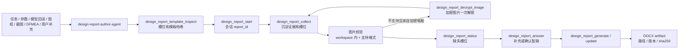

### 工作过程示意图

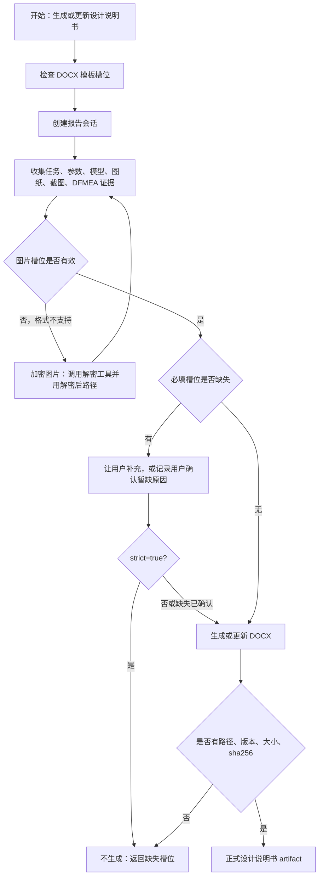

稳定性抓手：

- 报告事实只能来自工具结果、文件证据或用户确认。
- 图片必须在当前 workspace 内；外部绝对路径会被拒绝，避免报告引用不可交付文件。
- 图片格式不支持时，只按加密电脑场景解密一次；失败后请求替换或确认暂缺，不重复截图。
- 没有 DOCX 路径、版本、大小、sha256，不能称为报告完成。

## 12. 错误处理标准流程

每次线上或试用错误都按以下步骤处理，禁止只写“模型答错”。

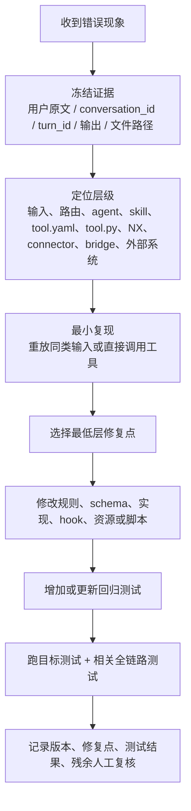

建议把每个错误单记录成 YAML，便于检索和复盘：

```yaml
id: mc-design-YYYYMMDD-001
date: "2026-06-26"
conversation_id: ""
turn_id: ""
task_type: "F1|F2|F3|F4|F5|F6|F7"
symptom: ""
expected: ""
actual: ""
evidence:
  user_input: ""
  output_excerpt: ""
  local_conversation_log: ""
  tjuae_live_trace: ""
  artifact_paths: []
layer:
  primary: "agent|skill|tool_yaml|tool_py|nx_plugin|ai_service|connector|external_system|test_data"
  reason: ""
fix:
  changed_files: []
  rule_added: ""
  deterministic_guard_added: false
regression:
  new_or_updated_tests: []
  commands: []
  result: "pass|fail|blocked"
residual_risk:
  manual_review_required: false
  note: ""
```

## 13. 分层定位方法

| 层级 | 典型现象 | 证据位置 | 应改位置 |
| --- | --- | --- | --- |
| 用户输入/任务内容 | 内容为空、截断、候选不唯一 | 子智能体输出、任务快照 | 对应 Skill 的缺口确认规则 |
| 主智能体路由 | 参数请求交给模板智能体、DFMEA 由主智能体直接做 | conversation log 的 agent 调用文本 | `design-agent.md`、`workflow-orchestration/SKILL.md` |
| 子智能体边界 | 子智能体调用越界工具 | tool events、agent frontmatter tools | 对应 agent `tools` 和边界说明 |
| Skill 流程 | 顺序错、没确认、没校验 | 输出缺少完成标准字段 | 对应 `SKILL.md` |
| 工具 YAML | 字段常填错、模型误解工具用途 | 工具输入、schema、description | `tool.yaml` |
| 工具 Python | 需要硬拦截危险输入或补文件元数据 | 工具返回 code/message | `tool.py` 或 `_common.py` |
| Hook | 工具调用前必须拒绝 | PreToolUse 输出 | `hooks/hooks.json`、`hooks/*.py` |
| NX 插件 | NX 工具执行失败或返回不完整 | NX 工具响应、NX 日志 | `nx-plugin/src` |
| K8s connector | 路由错、字段映射错、外部接口返回变形 | `/api/mc-design/connectors/execute` 响应 | `beya.toml`、`connector_router.py` |
| Runtime bridge | turn 不启动、断连、流式内容丢失 | AI service events、client bridge status | `runtime_bridge.py`、`bridge/client.py` |
| 交付物 | xlsx/docx/png 无效或缺哈希 | 文件路径、大小、sha256、validate 结果 | DFMEA/报告工具和测试 |

本地优先检查命令：

```powershell
curl http://127.0.0.1:8765/health
curl http://127.0.0.1:8765/api/status
curl "http://127.0.0.1:8765/api/runtime/connector-tools?conversation_id=<id>&agent_id=design_agent&user_id=<user>"
curl "http://127.0.0.1:8765/api/runtime/conversation-log?conversation_id=<id>"
```

日志优先级：

1. `client/logs/conversations/<conversation_id>.jsonl`：看用户输入、工具事件、工具失败、server message。
2. `client/logs/conversations/<conversation_id>.summary.json`：快速看最后状态、错误码、工具列表。
3. `client/data/runtime/tjuae-live-trace.jsonl`：看 session、插件同步、输入发送、权限请求。
4. AI service `/api/health` 和 `/api/mc-design/agents`：看 runtime 是否连接、协议是否匹配、K8s 是否只做 router。

## 14. 稳定性和正确率提升的可执行方法

### 14.1 每次修复只选一个最低层抓手

| 问题类型 | 不推荐做法 | 推荐抓手 |
| --- | --- | --- |
| 模型常选错工具 | 只追加“请不要选错” | 改 `tool.yaml` 描述和 input schema；必要时加 hook 拦截 |
| 工具字段经常缺 | 让模型记住字段 | 把字段设为 required，或在 `tool.py` 返回明确 `CODE_REQUIRED` |
| 计算结果错 | 改 prompt 让模型“认真计算” | 把公式放进 Excel/resource，用脚本抽取和校验 |
| 文件交付无效 | 让模型检查文件 | 工具实现生成 size/sha256，后续 validate 工具强制执行 |
| 外部系统不稳定 | 让模型重试很多次 | connector 返回结构化 retryable/code，测试覆盖超时和错误体 |
| NX 写入不确定 | 让模型口头确认 | 写后强制回读，回读不一致立即停线 |

### 14.2 7 类任务的验收门禁

| 任务 | 允许进入下一阶段的最低证据 |
| --- | --- |
| F1 任务入口 | 完整任务快照，包含任务编码、原文、项目、日期、状态、来源和完整性结论。 |
| F2 模板 | 已打开 NX WorkPart，并有 `nx_get_work_part_info` 返回。 |
| F3 参数 | 参数证据、公式状态、NX 表达式唯一映射、冲突项和写入计划草案。 |
| F4 建模/回传 | 用户确认计划、写入结果、回读结果、保存证据；TC 回传还需目标和覆盖策略。 |
| F5 图纸 | 图纸候选来源、用户选择、真实视图确认、截图路径、大小、sha256。 |
| F6 DFMEA | 模板检查、风险评分依据、填表结果、`dfmea_validate_workbook` 和文件哈希。 |
| F7 说明书 | 模板槽位检查、缺口处理记录、正式 DOCX 路径、版本、大小、sha256。 |

### 14.3 增加回归测试的具体做法

先确定测试应该放哪里：

- agent/skill/tool 契约：`mc-design-nx/client/tests/plugin/`
- runtime、桥接、插件同步：`mc-design-nx/client/tests/runtime/`
- Windows 打包：`mc-design-nx/client/tests/packaging/`
- AI service bridge/connector/LLM router：`mc-design-ai-service/tests/`

常用命令：

```powershell
cd mc-design-nx\client
python -m pytest tests\plugin\test_design_skill_contract.py
python -m pytest tests\plugin\test_formula_interpretation_pipeline.py
python -m pytest tests\plugin\test_dfmea_tools.py tests\plugin\test_design_report_generation.py
python -m pytest tests\runtime
```

```powershell
cd mc-design-ai-service
python -m pytest tests
```

每个 bug 至少要有一个失败后通过的回归点：

- 如果修 agent 或 Skill，测试断言关键边界文字、工具列表或禁止工具不存在。
- 如果修 tool.yaml，测试加载 `load_plugin_tool_definitions`，断言 schema、namespace、readOnly/destructive 注解。
- 如果修 tool.py，直接用本地 `McpToolRunner` 调工具，断言错误码、路径、hash 或校验结果。
- 如果修 connector route，测试 `ConnectorRouter.execute` 的入参、field map、默认值和错误结构。
- 如果修 bridge，测试 envelope 校验、超时、断连、heartbeat、runtime replacement。

### 14.4 持续改进节奏

建议每周固定执行：

1. 抽取过去一周错误单，按 F1-F7 和层级分类。
2. 统计每类错误数量、重复错误数量、人工复核数量、工具失败数量。
3. 优先处理重复错误最多且能在低层硬拦截的问题。
4. 每个修复都补测试，不允许只有文档改动。
5. 跑目标测试，再跑相关边界测试。
6. 更新错误单状态和残余风险。

建议量化指标：

| 指标 | 统计方式 | 目标 |
| --- | --- | --- |
| 禁止工具调用次数 | JSONL tool events 中出现越界工具 | 0 |
| 有副作用动作未确认次数 | 写入、保存、上传前缺确认记录 | 0 |
| 参数公式校验覆盖率 | 推导类参数中 `formula_source_status=checked` 的比例 | 100% |
| NX 写后回读覆盖率 | 写入项中有回读证据的比例 | 100% |
| DFMEA/报告 artifact 完整率 | 输出路径、大小、sha256、校验结果齐全 | 100% |
| 重复错误复发率 | 同 code 同原因再次出现 | 持续下降 |

## 15. 常见错误到修复动作速查

| 现象 | 直接操作 |
| --- | --- |
| 查询任务没带当前用户 | 查 runtime profile 是否注入；改 `enterprise-task-intake`；确认 `query_ipm_list` 默认和 hook。 |
| 候选表压缩任务内容 | 改 Skill 完成标准，要求原样输出 `display_markdown` 或 `taskName`；加输出快照测试。 |
| 模板候选后没打开 NX | 改 `nx-template-agent`，强制 `nx_open_tcpart` + `nx_get_work_part_info`；加合同测试。 |
| 参数智能体绕过 Excel | 改主智能体和参数 Skill，补公式脚本测试，断言 `not_required` 只用于直接目标值。 |
| 写入后继续执行但某项失败 | 改 `nx-parameter-execution` 和工具批量策略，失败即暂停并返回失败项。 |
| 截图文件路径在 workspace 外 | 保持 `nx_create_image` 工具拦截，补测试覆盖外部绝对路径。 |
| DFMEA 没校验就交付 | 改 `dfmea-author-agent` 完成标准，补 `dfmea_validate_workbook` 测试。 |
| 报告图片插不进 DOCX | 先看 `IMAGE_FILE_UNSUPPORTED`；若加密则解密一次；失败后补槽位处理，不重复生成。 |
| TC 上传权限失败 | 检查 `user_id`、`owner_id`、覆盖策略；不要重试绕过权限。 |
| Runtime turn 起不来 | 看 `/api/status`、`runtime_bridge.status`、WebSocket 协议 `turn-stream-v1`、是否同 user_id 被新客户端替换。 |

## 16. 结束标准

一次改进只有同时满足以下条件，才算完成：

- 错误有明确层级和证据，不再停留在“模型答错”。
- 修改落在最低层可控位置。
- 至少一个相关测试能证明问题不会复发。
- 对有副作用链路，确认、回读、保存、上传、校验等门禁没有被放宽。
- 工作记录包含改动文件、测试命令、测试结果和残余人工复核项。
