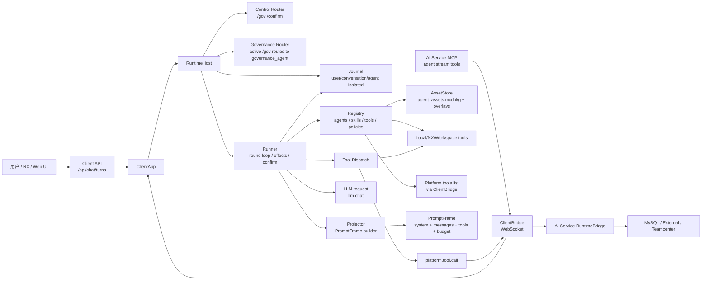
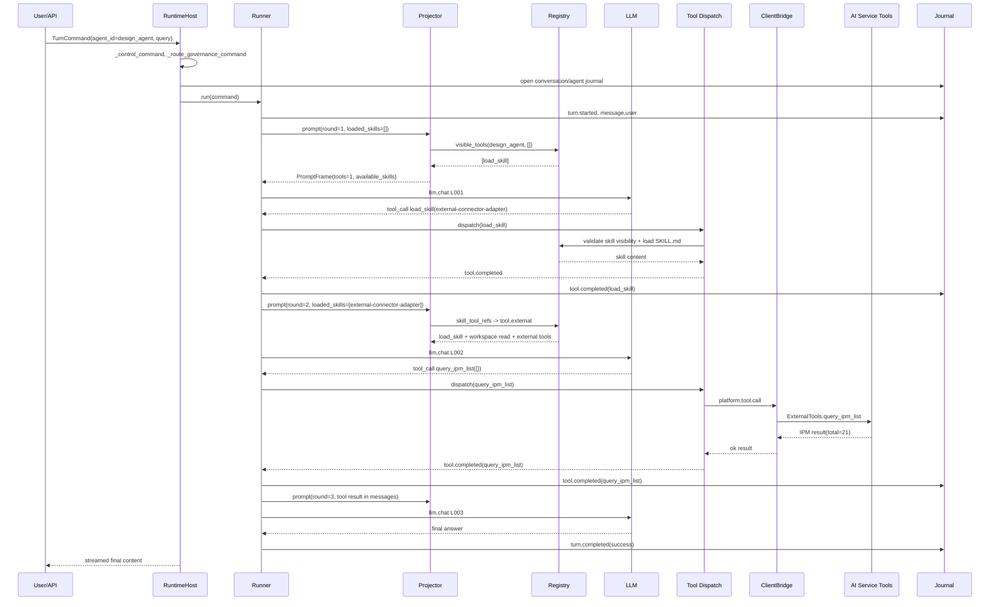

# Runtime 架构与测试数据渲染

数据来源：

- `client/client/data/.runtime/88000044/conversations/codex-skill-fix-check-20260529-normal/agents/design_agent/events.jsonl`
- `client/client/data/.runtime/88000044/conversations/codex-skill-fix-check-20260529-normal/agents/design_agent/artifacts/turn-76d4a839b52f4d96b49a0a3285f0be5a/L001-request.json`
- `client/client/data/.runtime/88000044/conversations/codex-skill-fix-check-20260529-normal/agents/design_agent/artifacts/turn-76d4a839b52f4d96b49a0a3285f0be5a/L002-request.json`
- `client/client/data/.runtime/88000044/conversations/codex-skill-fix-check-20260529-normal/agents/design_agent/artifacts/turn-76d4a839b52f4d96b49a0a3285f0be5a/L003-request.json`

## 架构图



## 运行时序图



## 本轮事件 Trace

| seq | event | round | 关键数据 |
|---:|---|---:|---|
| 1 | `turn.started` | - | mode=`normal` |
| 2 | `message.user` | - | 本地测试注入的中文在 artifact 中有编码损伤，业务链路不受影响 |
| 3 | `context.built` | 1 | `tool_count=1`, `context_chars=4805`, visible tool: `load_skill` |
| 4 | `llm.completed` | 1 | tool call: `load_skill` |
| 5 | `tool.requested` | 1 | `load_skill({"name":"external-connector-adapter"})` |
| 6 | `tool.completed` | 1 | loaded skill ok, capabilities: `tool.external`, `tool.workspace.read` |
| 7 | `context.built` | 2 | `tool_count=7`, loaded skill: `external-connector-adapter` |
| 8 | `llm.completed` | 2 | tool call: `query_ipm_list` |
| 9 | `tool.requested` | 2 | `query_ipm_list({})` |
| 10 | `tool.completed` | 2 | IPM returned `total=21` |
| 11 | `context.built` | 3 | query result appears as `role=tool` message |
| 12 | `llm.completed` | 3 | final answer, no tool calls |
| 13 | `turn.completed` | 3 | status=`success` |

## PromptFrame 示例

### L001-request: 初始轮

```text
tools:
- load_skill

loaded_skills: []

budget:
active_revision: 3
char_budget: 8000
context_chars: 4805
message_count: 2
round: 1
tool_count: 1

runtime_context excerpt:
available_skills:
- design-data-query tools=tool.mysql.query
- teamcenter-flow tools=tool.teamcenter.file,tool.teamcenter.query,tool.teamcenter.write,tool.workspace.read,tool.workspace.write
- external-connector-adapter tools=tool.external,tool.workspace.read

Load the matching skill from available_skills before using its tools;
do not ask the user for a skill name when the list already contains a matching domain skill.
```

这一轮只能调用 `load_skill`。这是预期行为：runtime 先让模型从 `available_skills` 选择领域 Skill。

### L002-request: 加载 external-connector-adapter 后

```text
tools:
- load_skill
- local_file_read
- local_workspace_status
- profile_get
- connect_qpp
- query_ecr_list
- query_ipm_list

loaded_skills:
- external-connector-adapter

messages:
[0] runtime_context
[1] user query
[2] assistant tool_call(load_skill)
[3] tool result(load_skill): SKILL.md content with tool.external capability
```

这一轮 `query_ipm_list` 已经可见，模型实际选择了它。

### L003-request: IPM 工具返回后

```text
tools:
- load_skill
- local_file_read
- local_workspace_status
- profile_get
- connect_qpp
- query_ecr_list
- query_ipm_list

loaded_skills:
- external-connector-adapter

messages:
[0] runtime_context
[1] user query
[2] assistant tool_call(load_skill)
[3] tool result(load_skill)
[4] assistant tool_call(query_ipm_list)
[5] tool result(query_ipm_list): ok=true, total=21
```

这一轮模型不再调用工具，直接基于 `query_ipm_list` 的工具结果生成最终回复。

## 检查点

1. `tool_count` 从 1 增加到 7，说明 Skill-gated tool activation 生效。
2. `query_ipm_list` 在加载 `external-connector-adapter` 前不可见，加载后可见，符合安全模型。
3. 本次没有 `effect.pending`，说明 IPM 查询没有走高风险确认；之前看到的 `/confirm` 是 `/gov` 治理模式文本，不是工具执行确认。
4. 如果 `/gov` active，普通业务请求会被路由到 `governance_agent`，业务 Skill 会不可见。这是定位工具“确认后也执行不了”的关键原因。
5. 当前 profile 里 `context.budget=1200`，但 Projector 有最低 `char_budget=8000` 保护，所以实际 prompt budget 是 8000；这里需要团队确认这是不是期望策略。
